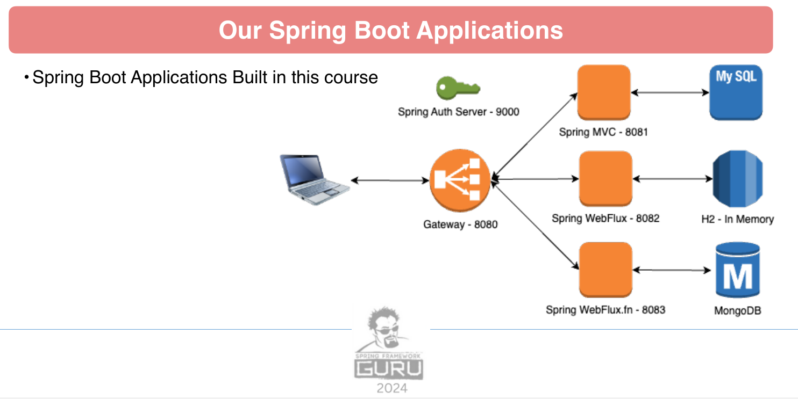

# spring-6-gateway
Examples of Reactive Programming with Spring Framework.

## Getting started
Server runs on port 8080. Requires that other projects are up and running
* spring-6-auth-server on port 9000
* spring-6-rest-mvc on port 8081
* spring-6-reactive on port 8082
* spring-6-reactive-mongo on port 8083
* spring-6-data-rest on port 8084
Example request you can find in the restRequest directory

## Urls
* openapi: 
  * http://localhost:8080/swagger-ui/index.html
  * http://localhost:30080/swagger-ui/index.html
* actuator: http://localhost:8080/api/v3/actuator/info



## Docker

### Images
* spring-6-gateway:0.0.1-SNAPSHOT
* spring-6-auth-server:0.0.1-SNAPSHOT
* spring-6-rest-mvc:0.0.1-SNAPSHOT
* spring-6-reactive:0.0.1-SNAPSHOT
* spring-6-reactive-mongo:0.0.1-SNAPSHOT
* spring-6-data-rest:0.0.1-SNAPSHOT

### create image
```shell
.\mvnw clean package spring-boot:build-image
```
or just run
```shell
.\mvnw clean install
```

Do this for all above projects to get the images into the local docker registry


## Docker

[Docker Documentation](docker-manual/DockerCommands.md)

## Kubernetes

[Kubernetes Documentation Manual](k8s-manual/KubeCommands.md)

The approach having all kubernetes files of the other projects here should be reworked. the kubernetes files should go into the 
appropriate projects, templating with helm and deployment into a kubernetes environment should be considered.

To run maven filtering for destination target/k8s and destination target/helm run:
```bash
mvn clean install -DskipTests 
```

### Deployment with Kubernetes

Deployment goes into the default namespace.

To deploy all resources:
```bash
kubectl apply -f target/k8s/ -R
```

To remove all resources:
```bash
kubectl delete -f target/k8s/ -R
```

Check
```bash
kubectl get deployments -o wide
kubectl get pods -o wide
```

You can use the actuator rest call to verify via port 30080

### Deployment with Helm

Be aware that we are using a different namespace here (not default).

Go to the directory where the tgz file has been created after 'mvn install'
```powershell
cd target/helm/repo
```

unpack
```powershell
$file = Get-ChildItem -Filter spring-6-gateway-v*.tgz | Select-Object -First 1
tar -xvf $file.Name
```

install
```powershell
$APPLICATION_NAME = Get-ChildItem -Directory | Where-Object { $_.LastWriteTime -ge $file.LastWriteTime } | Select-Object -ExpandProperty Name
helm upgrade --install $APPLICATION_NAME ./$APPLICATION_NAME --namespace spring-6-gateway --create-namespace --wait --timeout 8m --debug --render-subchart-notes
```

show logs and show event
```powershell
kubectl get pods -n spring-6-gateway
```
replace $POD with pods from the command above
```powershell
kubectl logs $POD -n spring-6-gateway --all-containers
```

Show Details and Event

$POD_NAME can be: spring-6-gateway-mongodb, spring-6-gateway
```powershell
kubectl describe pod $POD_NAME -n spring-6-gateway
```

Show Endpoints
```powershell
kubectl get endpoints -n spring-6-gateway
```

test
```powershell
helm test $APPLICATION_NAME --namespace spring-6-gateway --logs
```

status
```powershell
helm status $APPLICATION_NAME --namespace spring-6-gateway
```

uninstall
```powershell
helm uninstall $APPLICATION_NAME --namespace spring-6-gateway
```

delete all
```powershell
kubectl delete all --all -n spring-6-gateway
```

create busybox sidecar
```powershell
kubectl run busybox-test --rm -it --image=busybox:1.36 --namespace=spring-6-gateway --command -- sh
```

You can use the actuator rest call to verify via port 30080
